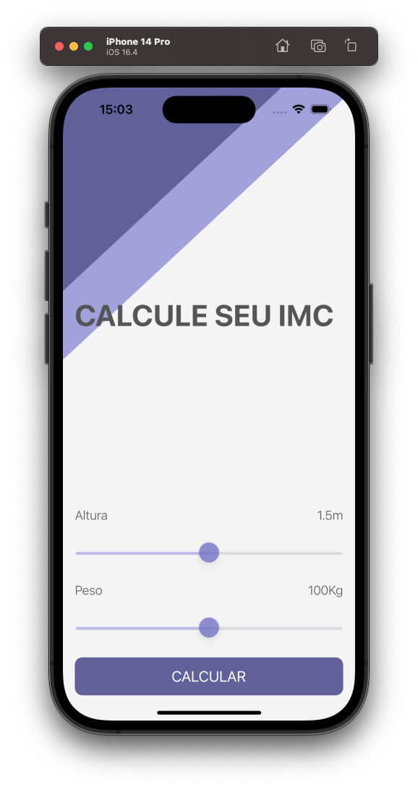

## Our Goal

The goal is to learn more about Optionals, solidify your understanding of the MVC design pattern and to introduce the concept of Classes. We’ll compare objects created from classes with instances of Structs that we learnt earlier.

## What we did

A Body Mass Index calculator. Based on the user’s weight and height it will calculate their body mass and give a piece of health advice depending on whether if they have eaten too many pies or if they need to eat more pies.

## What I've learn

- How to create multi-screen apps with animated navigation.
- Optional binding, optional chaining and the nil coalescing operator.
- How to create classes and difference between classes and structs.
- Pass by value vs. pass by reference.
- Formatting Strings.
- Color literals.

> This is a project made from The App Brewery's Complete App Developement Bootcamp, check out at [www.appbrewery.co](https://www.appbrewery.co/)
